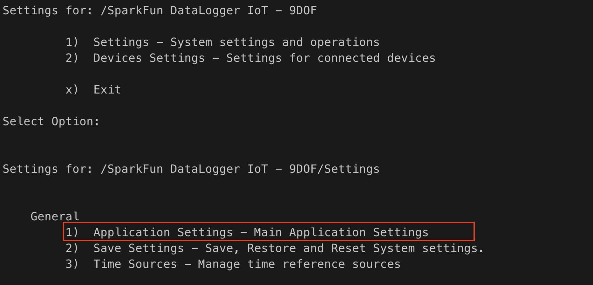
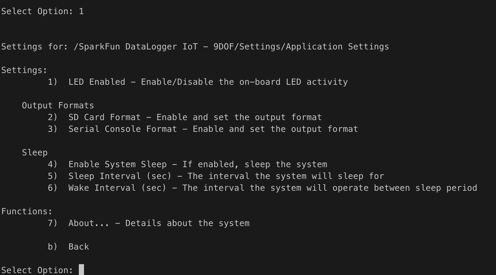
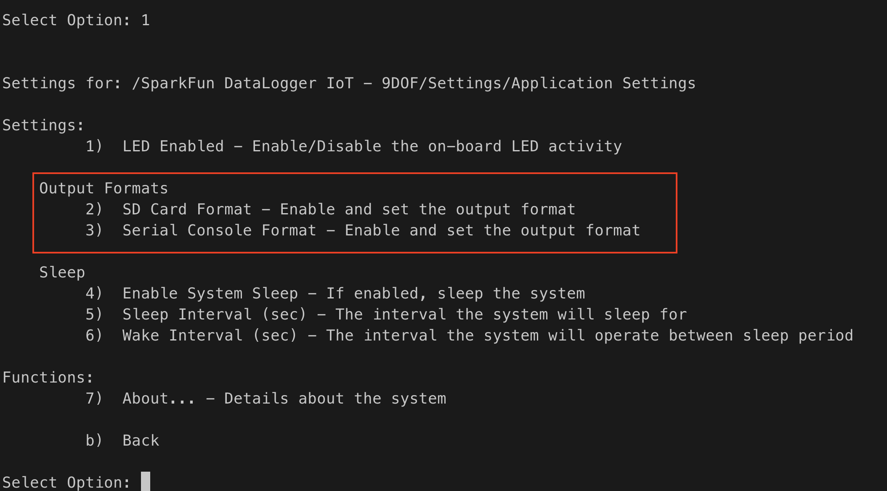
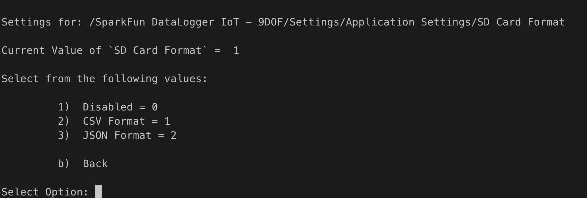
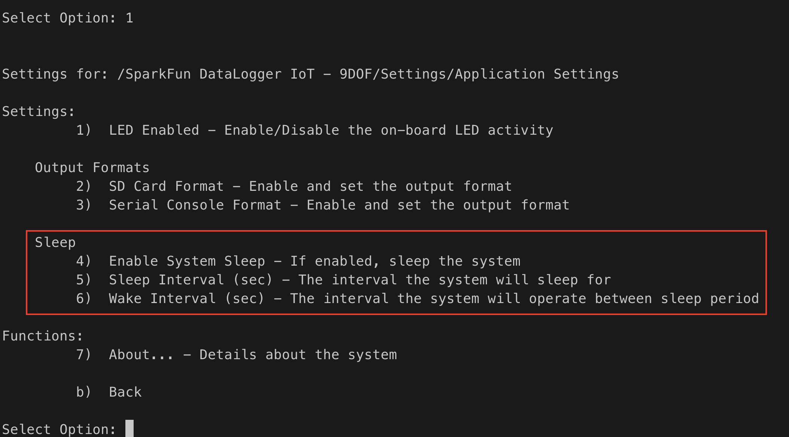
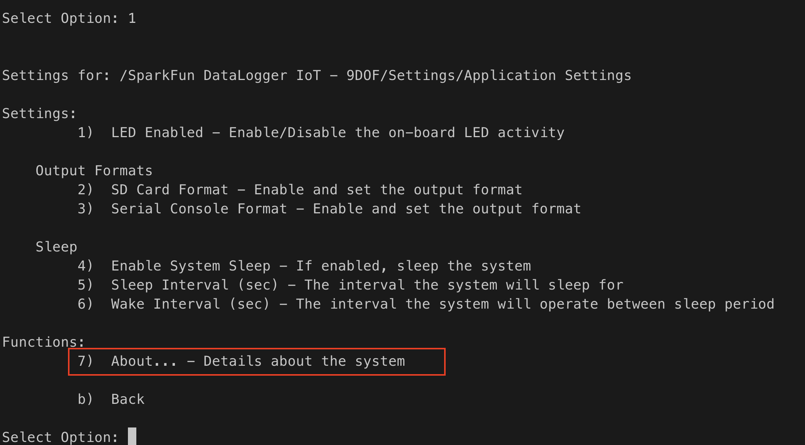
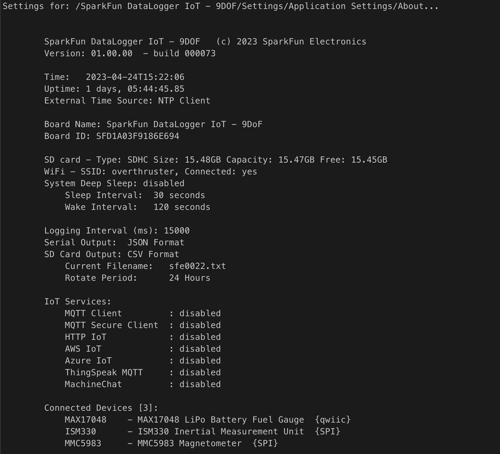

# Application Settings

> *ESP32*

The Application Settings menu option provides the following functionality to the user of the DataLogger:

* On-board LED control
* Log data output format
* System Sleep settings
* An *About Page* for the application state

This functionality is accessed via the Serial Console Settings Menu, which is required to use this capability.

This option is access by entering the menu system at the Serial Console, Selecting the *Settings*  (Option 1) menu item and then selecting the *Application Settings* page (option 1):

Selecting the *Applications Setting* Menu:

Once selected, the following options are presented:

## LED Enable

This option allows the user to enable/disable the on-board activity LED display. The LED is lit blue briefly when the system finishing logging an observation.

When selected, the following prompt is displayed:

Options for this setting are:

* 1 - Enabled activity display
* 2 - Disable activity display

## Output Formats

This section of the page enables setting the log output format for the *SD Card* and *Serial Console* outputs of the DataLogger. This menu section has entries for both output devices.

Selecting either option brings up a similar menu - allow the selection of the output format type.

The following options are presented:

* Disabled - No output to this device
* CSV Format - Output is in a CSV format
* JSON Format - Output is in a JSON format

**Note**
> When *CSV Format* is selected, a header line is output to the devices at startup, and whenever a new file is created for the output stream.

## Sleep 

This section of the page contains the settings for system sleep operation. System sleep is used to reduce power consumption of the DataLogger device, shutting down all major functionally of the device for a specified time period, then waking the device for normal operation for a specified time period.

To successfully use the *Sleep* functionally, the wake and sleep periods of this setting should be sufficiently log to support the overhead of the device sleep-wake cycle. 

The sleep settings are as follows:

* Enable System Sleep - Setting this value to  1 (true) enables the sleep functionality
* Sleep Interval - The number of seconds the device should sleep for
* Wake Interval - The number of seconds the device should wake for

## About ...

The last option of the menu is an **About Page**. 

When selected, the current state of the system is output to the console. 

Example *About* output:

The page contains the following information

* Product Name 
* Product version
* Current time on the board
* The amount of time the board has been operating 
* External time source - if one is being used
* Board ID
* SD Card parameters 
* Device Sleep settings
* Logging system parameters - output devices and formats
* If logging to a file, the current file name and file rotation period
* Status of IoT services
* List of devices connected to the DataLogger

