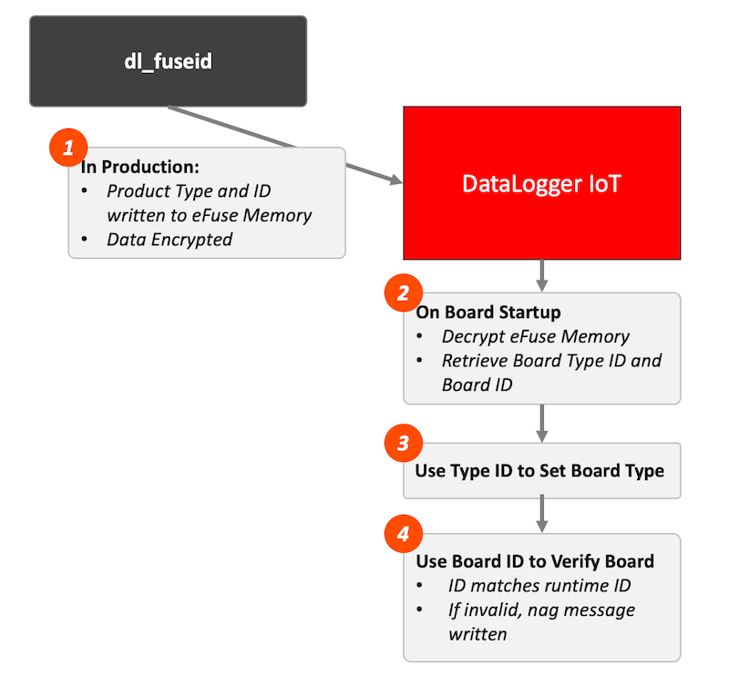

# DataLogger Fuse ID Command Line Tool

This folder contains the DataLogger ID tool, `dl_fuseid`, which is used to write the board type and ID to the eFuse memory of the DataLogger's ESP32 module.This tool is intended for use during DataLogger production.

The `dl_fuseid` tool source is contained in this folder. Written in Python, is installed using the standard Python `pip` command.

With the information is written to a DataLogger IoT eFuse memory, the DataLogger firmware can determine the board type at startup, and if the DataLogger Firmware is running on a SparkFun board.

To setup the SparkFun Production Environment, jump to [Setup SparkFun Production](#sparkfun-production-setup)

## Operation Overview

The operation of this system is outlined in the following image.



1. During production the `dl_fuseid` is run to write the Board Type and Board ID to the eFuse memory (BOCK3) on the ESP32 module. These values are encrypted before writing.
2. On firmware startup, the value from eFuse BLOCK3 is read and decrypted. The board type ID and Board ID are extracted from this memory value
3. The board type ID is used to identify the board type. This value is set in the firmware framework and reflected to the board user
4. The Board ID is compared to the runtime ID. If the IDs fail to match - indicating the firmware is not running on a SparkFun board, a ***nag*** message is written to the log data stream.

## Installation

The `dl_fuseid` command is packaged as an installable python package during the GitHub build process for the DataLogger firmware. The GitHub build *Action* generates an artifact called "Flash ID CLI Tool". Downloading this artifact and unzipping the file the install package for the `dl_flashid` tool - `sfe_dl_fuseid-0.5.0.tar.gz`.

The tool installs like any standard Python package. As such, installation has the following steps:

1. Make sure Python (v 3.10 or higher) is installed on the target system. Note, the method to do this depends on your system - visit the [Python Web Site](https://python.org) for more information. 
2. Install the `setuptools` package - `pip install setuptools`
3. Install the fuse id tool package `pip install sfe_dl_fuseid-0.5.0.tar.gz`

The Package Install Command:

```sh
pip install sfe_dl_fuseid-0.5.0.tar.gz
```

At this point, the `dl_fuseid` is available at the command line. Note, the shell might need to be restarted or `rehash` (unix) called to have the command available. Some cases, Windows might need restarting (?).

To verify the command is installed, enter the following at the command line:

```sh
dl_fuseid -h
```

Which outputs the help menu for the command:

```sh
usage: dl_fuseid.py [-h] [--port PORT] [--board {DLBASE,DL9DOF}] [--key KEY] [--version] [-d] [-t]

SparkFun DataLogger IoT ID fuse utility

options:
  -h, --help            show this help message and exit
  --port PORT, -p PORT  Serial port device
  --board {DLBASE,DL9DOF}, -b {DLBASE,DL9DOF}
                        Board type name
  --key KEY, -k KEY     Fuse encryption key
  --version, -v         Print version
  -d, --debug           sets debug mode
  -t, --testing         Uses the test key
```

### Short Cut Commands

To simplify the use, the above package installs shortcut commands, which include the board type already set. These commands are:

| Command Line | Description |
|----------|--------------|
dl_fuseid_base | The value of `--board` is automatically set to **DLBASE** |
dl_fuseid_9dof | The value of `--board` is automatically set to **DL9DOF** |

## Command Use

When using the command, the following parameters are required:

| Option | Value |
|------------------|-----|
--port | The port the device is plugged into on the system (COM, /dev/tty.usb...)
--board | The board type to set the board to (DLBASE, DL9DOF, ...)
--key | The encryption key to use for the data. This can be skipped if the --testing option is set - which uses the development key.

### Keys

The key must match the key that the Firmware uses, so the data contained in the eFuse memory is decrypted correctly. There are two general key types: Production and Development.

#### Development Key

The Development key is used when the `-t, ---testing` option is provided to the `dl_fuseid` command. This key is used by the Firmware when not build in a production environment (on a local development machine).

#### Production Key

For production, the production key is provided to the `dl_fuseid` command. This is key is available in the `dl_fuseid` repository and specified using the `-k, --key` command option. This key is compiled into the DataLogger as part of the production build Action (on GitHub). 


### Config File

The `dl_fuseid` command options can be specified in a config file, allowing simple and consistent operation. 

The config file uses a simple ```key=value``` syntax to define values. The available option values are:

| Option | Description |
|----------|----------|
| fuse_key | The encryption key to use for the fuse operation |
| fuse_port | The system port the board is connected to |
| fuse_board | The board type to use for the fuse operation |
| log_file | If set to true, messages are also written to a log file |
| debug | If set to true, debug information is written during the fuse operation |

The config file can be placed:

| File Name | Location |
|------|-----|
|dl_fuseid.conf | The users home directory |
|.dl_fuseid | The users home directory |]

Example config file contents:

```config
# Fuse encryption key
fuse_key='3Y3rOODfH4DV5XgpP/vkf6CHBZ2Rg3TI'

# Fuse connected device prot
fuse_port= 'COM5'

# Fuse board
fuse_board= 'DL9DOF'
```

## Logging

The `dl_fuseid` command will log output of the config file option `log_file` is set to true. When enabled, output is written to a file named `sfe_dl_fuseid.log` in the `Documents` directory in the users home folder. 

Note: The log file is rotated over time to ease log management.

## Examples

#### Burning to a DataLogger IoT board on Windows - Developer

```sh
dl_fuseid -t --port COM5 -b DLBASE
```

#### Burning to a DataLogger IoT board on macOS - Developer

```sh
dl_fuseid -t --port /dev/tty.usbserial-139 -b DLBASE
```

#### Burning to a DataLogger IoT 9DOF board on Windows - Developer

```sh
dl_fuseid -t --port COM5 -b DL9DOF
```

#### Burning to a DataLogger IoT board on Windows - Production

```sh
dl_fuseid -k <PRODUCTION KEY> --port COM5 -b DLBASE
```

## Developer Notes

To add additional boards to the system:

* For the fuse id command, add the board hex ID and Name ID to the top of the file `dl_fuseid.py` in the command source folder.
* If the DataLogger Firmware, add the board ID to the macros in the file `sfeDLMode.h`, add entries to the board info array in `sfeDLMode.cpp` and add an entry to the type match logic at the end of the `dlModeCheckSystem()` function. 

This could be easier to maintain - something for future releases. 

## SparkFun Production Setup

To setup this command for the SparkFun production environment, the following tasks are performed:

1. Install the dl_fuseid python package as outlined above in this document
2. From the current release of the DataLogger IoT firmware, download the production config file and install it in the home directory of the account that runs the production command. This file contains the production key used to encrypt the data written to the board
3. Determine the port that the connected board appears at on the production board, and set that value for the key `fuse_port=` in the config file placed in the home directory in step 2. 
4. If the appropriate short cut command is used for the board being tested/written to, the production team can just enter the board, no options required.